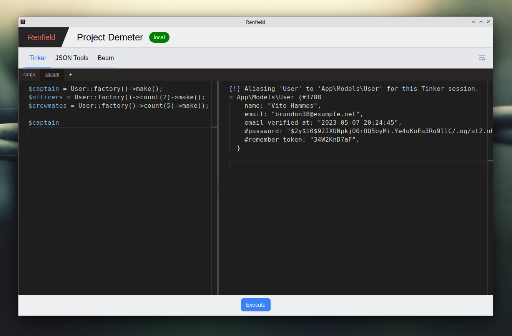

# Renfield

Just as Renfield was a loyal companion to Dracula and did all his dark bidding, this project exists to help you with all your Laravel debugging needs.

More seriously, it's a couple of tools that I find handy when working with Laravel projects, put together as a desktop app. Created mostly as an excuse to play with [wails](https://wails.io).

While this project is still in pretty fluid state - stuff is being added, changed and moved around - the basic functionality is already there. 

## Tools

- **Tinker** - an interface for Lararavel Tinker
- **JSON Tools** - an easy way to avoid pasting JSON on random sites on the internet - pretty format, convert from and to PHP arrays
- **Beam** - super simple remote debugging with HTTP calls - it's not xDebug, but it won't stop application flow like `dd()` or spam UI like `dump()`

## Roadmap

- [x] Tinker
- [x] JSON Formatter
- [x] Remote debugger
- [x] PHP arrays / JSON converter
- [x] code editor tabs
- [ ] Grepping JSON - to help with analyzing larger JSON payloads
- [ ] Static analysis tools - show info on models / relations / routes
- [ ] Log viewer
- [ ] saved snippets / bookmarked code
- [ ] dynamic message filtering
 
## Development

Requirements: 

- go 1.18+
- npm
- `wails` command (https://wails.io/docs/gettingstarted/installation)

To run in live development mode, run `wails dev` in the project directory. This will run the project with hot-reload. You might need to run `npm install` inside the `frontend` directory first.

## Building

    wails build

This will produce a binary in `build/bin/` directory.

---

  
Renfield in Dracula (1931)

